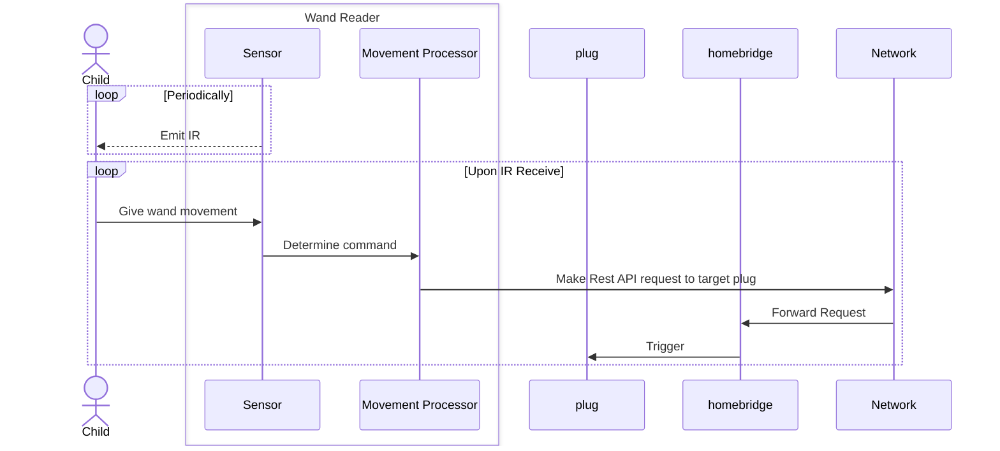

# Raspberry Pi Ansible User Setup

This guide explains how to prepare your Raspberry Pi for Ansible automation by creating a dedicated user account with passwordless sudo and SSH key authentication.

## 1. Initial Access

- Boot your Raspberry Pi and ensure it is connected to your network.
- Find its hostname or IP address (e.g., `raspberrypi.local` or `192.168.x.x`).
- From your control machine, connect using the default `pi` user:

```ini
# For first bootstrap (Password is laptop password)
[raspberrypi]
192.168.68.54 ansible_user=aquilesgomez
# For subsequent commands
[raspberrypi]
192.168.68.54 ansible_user=ansible
```

## Intent

This is a project that will use a `RaspberryPi` in conjunction with
`homebridge` to control multiple objects around the house.

### Architecture

We will create multiple processes to monitor wand movements and another process
to trigger `homebridge` requests.


